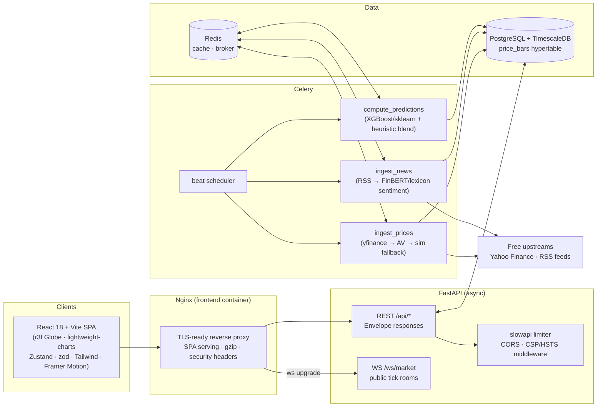

# ORION 🛰️ — Global Market Intelligence & Predictive Trading Dashboard

ORION is an open-source market intelligence platform: an interactive 3D globe
for market selection, live tickers and charts, top-mover rankings, an
algorithmic **Underdog Scanner**, a hybrid **Predictive Analysis Engine**
(technical indicators + news sentiment), a sentiment-labelled **news
aggregator**, and a free **Fear & Greed index**.

> ⚠️ ORION is an educational/portfolio project. Nothing it produces is
> investment advice. Predictions are statistical estimates from public data,
> not guarantees.

## ✨ Highlights

- **100% free to run.** Every data source is free: Yahoo Finance (`yfinance`)
  and official publisher RSS feeds. No paid API
  keys anywhere. Optional Alpha Vantage / NewsAPI keys enhance coverage but
  are never required.
- **Zero-trust security posture.** JWT access tokens (15 min) + single-use
  rotating refresh tokens in HttpOnly/SameSite=Strict cookies, per-IP rate
  limiting, strict CORS allowlist, CSP + hardening headers on every response,
  parameterized queries only, generic error envelopes with structured JSON
  logging, WebSocket JWT gating with frame-size caps, secret scanning +
  `pip-audit` + `npm audit` gates in both Docker builds and CI.
- **Graceful degradation everywhere.** If a feed is blocked or rate-limited,
  ORION serves cached or deterministic simulated data (clearly badged
  "SIMULATED FEED" in the UI) instead of breaking.
- **Session-fresh data & live market clocks.** Charts never go stale: once a
  market's session is live, lagging upstream daily bars are topped up with a
  *forming* candle and WebSocket ticks open today's bar client-side. A
  Market Clocks panel shows every exchange's local time with a live
  OPEN/CLOSED session badge.
- **Uniform API envelope.** Every endpoint returns
  `{ "status": "success|fail", "data": ..., "message": ..., "timestamp": ... }`.

## 🏗️ Architecture



## 🚀 Quickstart

Prerequisites: [Docker](https://docs.docker.com/get-docker/) + Docker Compose.
That's it.

```bash
git clone https://github.com/ayush-neupane/orion.git
cd orion
cp .env.example .env
# IMPORTANT: generate a real secret key and paste it into .env:
python -c "import secrets; print(secrets.token_hex(32))"

docker compose up --build
```

When everything is up:

- **Dashboard:** http://localhost:8080
- **API:** http://localhost:8000/api/market/regions (envelope JSON)
- **Swagger docs (dev only):** http://localhost:8000/docs

First-run behaviour: Celery beat ingests prices every 60 s, news every 30 min,
and recomputes predictions every 10 min. The very first dashboard load may
show "simulated" badges for a minute until real bars land; predictions are
also computed inline on first request so nothing is ever empty for long.

### Native development (no Docker)

The backend falls back to a local SQLite database when `DATABASE_URL` is
unset, so you can run the full dashboard without Postgres/Redis:

```bash
cd backend
pip install -r requirements.txt
uvicorn app.main:app --reload        # API on http://localhost:8000

cd ../frontend
npm install
npm run dev                          # dashboard on http://localhost:5173
```

The Vite dev server proxies `/api` and `/ws` to :8000. Celery/Redis are only
needed for scheduled background ingestion — every on-demand endpoint
computes inline.

### Make targets

```bash
make run             # build & start the whole stack
make migrate         # idempotent schema migration (tables + hypertable)
make test            # backend pytest with >=85% coverage gate
make lint            # flake8 + eslint/tsc
make security-check  # gitleaks + pip-audit + npm audit
make down            # stop stack
make clean           # stop stack AND wipe volumes
```

## 📁 Project layout

```
.
├── docker-compose.yml        # postgres, redis, backend, worker, beat, frontend
├── Makefile                  # run / migrate / test / security-check / lint
├── .env.example              # every variable documented (no real secrets!)
├── .github/workflows/main.yml# lint → security → tests(85% gate) → e2e
├── backend/
│   ├── Dockerfile            # deps → pip-audit gate → slim non-root runtime
│   ├── requirements.txt      # pinned (see note: requests-html rejected)
│   ├── pytest.ini            # coverage + flake8 config
│   ├── app/
│   │   ├── main.py           # lifespan, SIGTERM handling, exception handlers
│   │   ├── config.py         # pydantic-settings (12-factor)
│   │   ├── database.py       # engine/session + idempotent schema bootstrap
│   │   ├── models.py         # SQLAlchemy ORM + Pydantic v2 schemas
│   │   ├── celery_app.py     # idempotent ingestion/prediction tasks
│   │   ├── websocket_manager.py
│   │   ├── db_migrate.py     # python -m app.db_migrate
│   │   ├── middleware/security.py
│   │   ├── routers/          # auth · market · news · watchlist · ws
│   │   ├── services/         # scraper · sentiment · predictor · universe
│   │   └── utils/            # logger · security(JWT/bcrypt)
│   └── tests/                # unit · security · integration · api flows
└── frontend/
    ├── Dockerfile            # build → npm audit gate → nginx runtime
    ├── nginx.conf            # SPA + /api + /ws proxying + headers
    ├── e2e/dashboard.spec.ts # Playwright specs
    └── src/
        ├── components/       # Globe · Chart · Ticker · TopMovers · UnderdogScanner
        │                     # PredictionsTable · NewsPanel · FearGreedWidget · RegionClock · Header
        ├── pages/Dashboard.tsx
        ├── store/marketStore.ts
        ├── api/client.ts     # envelope validation + silent token refresh
        └── types/market.ts   # zod schemas for every payload
```

## 🔌 API surface (all responses enveloped)

| Method | Path | Auth | Description |
|---|---|---|---|
| POST | `/api/auth/register` | — | Create account (returns pair + cookie) |
| POST | `/api/auth/login` | — | Login. Rate-limited 5/min/IP |
| POST | `/api/auth/refresh` | cookie | Single-use refresh rotation |
| POST | `/api/auth/logout` | bearer | Revoke all refresh tokens |
| GET | `/api/auth/me` | bearer | Current user |
| GET | `/api/market/regions` | — | Region list + index map |
| GET | `/api/market/movers?region=` | — | Top 10 gainers/losers/most active |
| GET | `/api/market/history/{symbol}?region=` | — | OHLCV bars (+ `simulated` flag) |
| GET | `/api/market/predictions?region=` | — | P(up), BUY/HOLD/SELL per symbol |
| GET | `/api/market/underdogs?region=` | — | Potential Breakout score ≥ threshold |
| GET | `/api/market/search?q=` | — | Regex-sanitized symbol search |
| GET | `/api/market/fear-greed` | — | Free Fear & Greed gauge |
| GET | `/api/news?region=&limit=` | — | Headlines + BULLISH/BEARISH/NEUTRAL |
| GET/POST/DELETE | `/api/watchlists...` | bearer | Per-user watchlist CRUD |
| WS | `/ws/market?token=<jwt>` | optional | Live tick rooms — anonymous (guest) connections allowed; invalid supplied tokens refused |

## 🧠 The prediction model

For every symbol ORION computes RSI(14), MACD(12,26,9), Bollinger %B,
1d/5d returns, volume ratio vs 10-bar mean, SMA20 ratio, then:

1. **Heuristic vote** (always available): weighted indicator votes squashed
   through a logistic function, blended with news sentiment.
2. **Gradient-boosted classifier** (XGBoost, sklearn fallback) when ≥80 bars:
   trained on 5-day-forward direction; blended 55/45 with the heuristic.

Outputs: `prob_up` (0-1) → BUY ≥0.58 / SELL ≤0.42 / HOLD, and an
**Underdog breakout score (1-100)** from low P/E + rising 3-day volume +
positive sentiment + early momentum.

## 🔒 Security model (the "Impenetrable" clause)

| Control | Implementation |
|---|---|
| Secrets | `.env` only; gitleaks in CI + placeholder check in test suite |
| Passwords | bcrypt (passlib deliberately avoided — unmaintained, breaks on bcrypt ≥4.1) |
| Sessions | 15-min access JWTs; refresh JWTs carry a JTI, stored hashed, revoked on logout, rotated single-use |
| Brute force | slowapi: `5/minute` per IP on login (+30/hour), generic errors prevent user enumeration |
| Injection | SQLAlchemy ORM exclusively; all inbound strings regex-validated & length-capped |
| Headers | CSP, HSTS(prod), X-Frame-Options DENY, nosniff, Referrer-Policy, Permissions-Policy |
| Data leakage | Clients get `{status:"fail", message}` only; stack traces go to rotating JSON log files via structlog |
| WebSocket | Tick data is public: guest connections accepted; a supplied-but-invalid JWT is refused (close 4001); frames >1 MB closed with code 1009 |
| Dependencies | `pip-audit --strict` stage in backend image; `npm audit --audit-level=critical` in frontend build; both fail the build |
| CORS | Explicit allowlist from `CORS_ORIGINS`; credentials enabled |

**Production note:** deploy behind TLS (e.g., Caddy/Traefik or a cloud LB).
The Secure-cookie flag is always set; browsers only accept it over plain HTTP
on localhost.

## 🧪 Testing

```bash
cd backend && python -m pytest --cov=app --cov-fail-under=85 -q
cd frontend && npx playwright test   # against a running stack at :8080
                                     # (override with E2E_BASE_URL=http://localhost:5173)
```

Suites: indicator math unit tests, security tests (rate limiting, CORS,
injection, WS auth, envelope integrity), integration tests with mocked HTTP
(`respx`) and eager Celery, and Playwright E2E for globe/chart/search.

## 🛠️ Troubleshooting

**`docker compose up` fails: "SECRET_KEY must be set"**
You skipped copying `.env.example` → `.env`. Do that and paste a generated key.

**Backend unhealthy / DB connection refused**
Postgres takes ~10-20 s to initialize. Compose healthchecks handle ordering;
if you still see failures: `docker compose logs postgres`. If you previously
ran with different credentials, wipe volumes: `make clean`.

**Migration errors (`create_hypertable` fails)**
You may be running plain Postgres instead of the TimescaleDB image. ORION
degrades gracefully (plain tables), but for time-series features use
`timescale/timescaledb:latest-pg16`. Re-run idempotently any time:
`docker compose run --rm backend python -m app.db_migrate`.

**The chart's last candle is "old" (previous session)**
Daily candles only exist per trading session — weekends/holidays have no bar,
so on Monday morning the newest completed candle is Friday's. ORION adds a
*forming* candle for the live session automatically: once the US session has
started (≥ 09:30 ET) the backend tops up lagging daily feeds with the live
price, and the frontend opens today's candle from the first WebSocket tick /
REST quote. Pre-open, the previous close is correctly the latest data.

**Yahoo rate-limits me ("falling back to simulation" in logs)**
Free Yahoo endpoints throttle aggressive IPs. ORION spaces requests and caps
symbols per region; if throttled it serves deterministic simulated bars with
a visible badge. Add outbound proxies via `PROXY_URL=`, wait a few minutes,
or lower `INGEST_INTERVAL_SECONDS` impact by reducing regions in
`app/services/universe.py`.

**News freshness**
Only headlines from the last 72 hours are served by default; when that
window is too thin it widens to a hard maximum of 7 days. Anything older
is never ingested or rendered.

**FinBERT vs lexicon sentiment**
By default ORION ships without PyTorch to stay lightweight and free. Install
optional ML extras for transformer-based scoring:
```bash
pip install transformers==4.47.1 torch --index-url https://download.pytorch.org/whl/cpu
```
The app auto-detects them at runtime; otherwise the deterministic finance
lexicon is used (identical API, no downloads).

**Why not `requests-html`?**
It was requested originally but is unmaintained and pulls a vulnerable
pyppeteer chain. ORION uses `httpx` + BeautifulSoup4 instead — same scraping
capability, actively maintained, smaller attack surface.

**Port conflicts**
Frontend binds 8080, backend 8000. Change mappings in `docker-compose.yml`.

## 📄 License

MIT — see [LICENSE](LICENSE). Market data belongs to its publishers; respect
their terms of service when deploying publicly.


